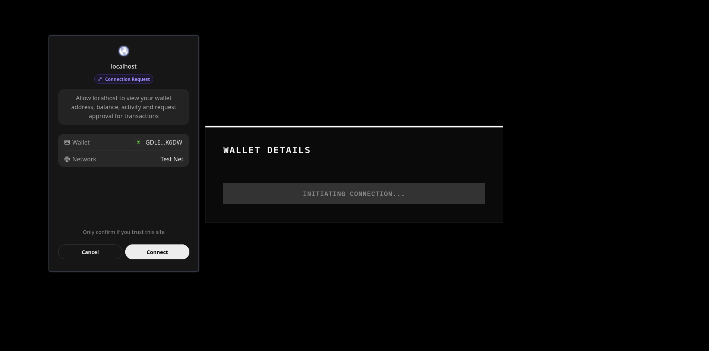
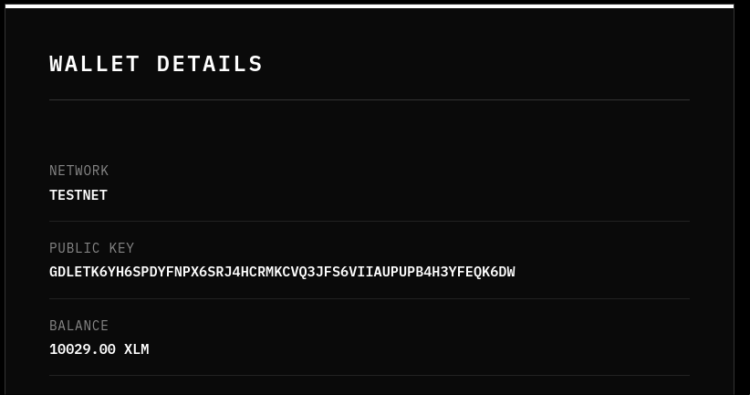
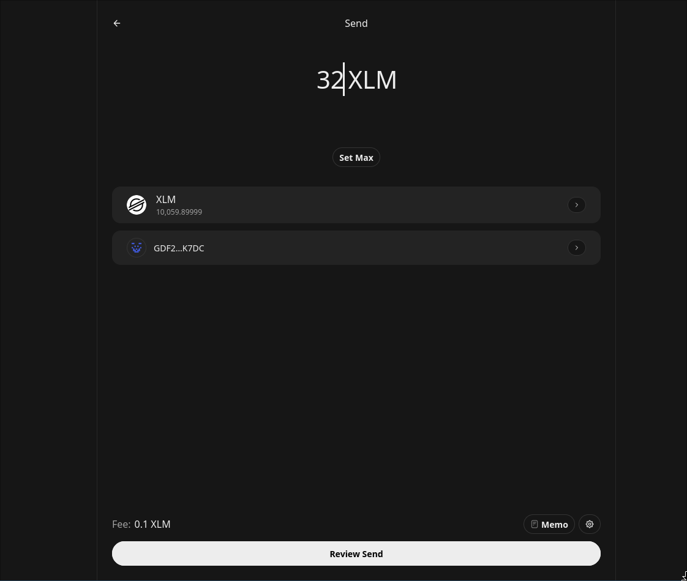
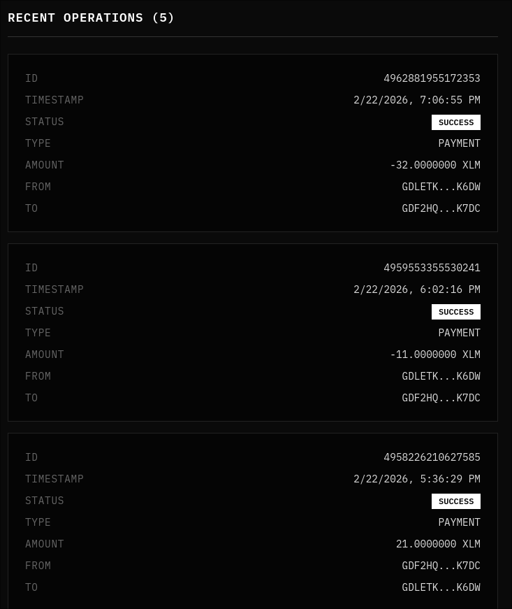

# Transaction History Viewer

A simple, modern React application that allows users to seamlessly connect their [Freighter](https://www.freighter.app/) wallet to interact with the Stellar Testnet. Once connected, users can easily view their public key, display their current XLM account balance, and monitor recent network transactions directly from the dashboard.

1. **Clone the repository:**
   ```bash
   git clone https://github.com/mrshirolu/stellar-transaction-history-viewer.git
   cd stellar-transaction-history-viewer
   ```

2. **Install dependencies:**
   Make sure you have Node.js and npm installed. Then run:
   ```bash
   npm install
   ```

3. **Start the development server:**
   ```bash
   npm start
   ```

## Screenshots

### Wallet Connected State


### Balance Displayed


### Successful Testnet Transaction


### Transaction Result

